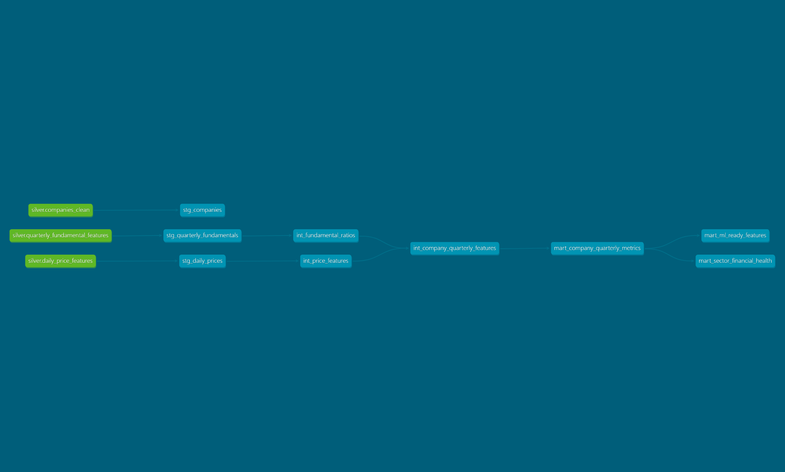

# Financial Lakehouse Analytics Pipeline

## Overview

`financial-lakehouse-analytics-pipeline` is a local analytics engineering project built from scratch for portfolio use. It generates synthetic financial data, processes raw CSV files into curated silver-layer Parquet datasets with PySpark, and uses dbt with DuckDB to build tested analytics marts.

The project is intentionally focused on core data engineering and analytics engineering skills. It does not use Databricks, cloud services, external APIs, dashboards, or machine learning models.

## Why This Project Exists

Many portfolio projects stop at notebooks or simple charts. This repository is designed to show a more complete analytics workflow:

- synthetic raw data generation
- raw-to-silver ETL with Apache Spark / PySpark in local mode
- local lakehouse storage with Parquet
- SQL modeling with dbt
- local analytical execution with DuckDB
- data quality testing and documentation

The goal is to keep the scope realistic, interview-friendly, and fully runnable on a local machine.

## Technical Demo

This repository includes a static technical demo built around dbt Docs. The public technical demo opens directly into the static dbt Docs site at the overview page and shows model documentation, lineage, sources, staging/intermediate/mart layers, tests, and the final marts.

This is a static technical demo, not a live dashboard or live data application.

Direct dbt Docs demo URL:

[dbt Docs & Technical Demo](https://diegokusterr.github.io/financial-lakehouse-analytics-pipeline/dbt-docs/#!/overview)

This opens the static dbt Docs technical demo directly at the dbt overview page.

Portfolio-ready description:

Built from scratch, this project demonstrates a local financial lakehouse pipeline using PySpark for raw-to-silver ETL, Parquet for storage, and dbt with DuckDB for tested SQL transformations, lineage and analytics marts.

Recommended demo button label:

`dbt Docs & Technical Demo`

## Architecture Diagram

```text
Synthetic CSV generator
        |
        v
data/raw/
  - companies.csv
  - daily_prices.csv
  - quarterly_fundamentals.csv
        |
        v
PySpark ETL
  - schema checks
  - deduplication
  - type casting
  - standardization
  - missing value handling
  - window-based feature engineering
        |
        v
data/silver/
  - companies_clean/
  - daily_price_features/
  - quarterly_fundamental_features/
        |
        v
dbt + DuckDB
  - staging models
  - intermediate models
  - marts
  - schema tests
        |
        v
data/gold/
  - mart_company_quarterly_metrics.parquet
  - mart_sector_financial_health.parquet
  - mart_ml_ready_features.parquet
  - finance_analytics.duckdb
```

## Visual Documentation

This project intentionally does not include a dashboard. The focus is the data foundation: synthetic data generation, raw-to-silver ETL, SQL modeling, data quality tests, and documented marts.

```text
Synthetic financial data generated locally
        |
        v
Raw CSV files in data/raw/
        |
        v
PySpark ETL in src/spark_etl.py
  - Spark DataFrames
  - window functions
  - native Spark Parquet writing
        |
        v
Curated Parquet datasets in data/silver/
        |
        v
dbt models on DuckDB
  - staging
  - intermediate
  - marts
  - tests
        |
        v
Analytics-ready outputs in data/gold/
```

dbt documentation can be generated and served locally with:

```bash
dbt docs generate --project-dir dbt_finance --profiles-dir dbt_finance
dbt docs serve --project-dir dbt_finance --profiles-dir dbt_finance
```

The dbt documentation site acts as the technical visual layer of the project, showing model lineage, sources, tests and downstream marts without adding a separate dashboarding tool.

dbt docs provide model documentation, lineage and test visibility. The final marts are designed to be consumed later by BI tools, notebooks or ML workflows, while this repository stays focused on ETL, modeling and data quality.



dbt lineage graph showing the flow from curated Parquet sources into staging, intermediate and mart models.

Final mart design examples:

- `mart_company_quarterly_metrics`: company-level financial analysis
- `mart_sector_financial_health`: sector-level reporting
- `mart_ml_ready_features`: downstream ML or analytical modelling

## Tech Stack

- Python 3.11
- PySpark
- Apache Spark / PySpark in local mode
- dbt Core
- dbt-duckdb
- DuckDB
- Parquet
- Pandas and NumPy for synthetic data generation

## Folder Structure

```text
financial-lakehouse-analytics-pipeline/
|-- data/
|   |-- raw/
|   |-- silver/
|   `-- gold/
|-- src/
|   |-- spark_support/
|   |   `-- WindowsSafeRawLocalFileSystem.java
|   |-- generate_synthetic_data.py
|   |-- spark_etl.py
|   `-- validate_outputs.py
|-- dbt_finance/
|   |-- dbt_project.yml
|   |-- profiles.yml.example
|   `-- models/
|       |-- staging/
|       |   |-- stg_companies.sql
|       |   |-- stg_daily_prices.sql
|       |   |-- stg_quarterly_fundamentals.sql
|       |   `-- schema.yml
|       |-- intermediate/
|       |   |-- int_price_features.sql
|       |   |-- int_fundamental_ratios.sql
|       |   |-- int_company_quarterly_features.sql
|       |   `-- schema.yml
|       `-- marts/
|           |-- mart_company_quarterly_metrics.sql
|           |-- mart_sector_financial_health.sql
|           |-- mart_ml_ready_features.sql
|           `-- schema.yml
|-- docs/
|   |-- assets/
|   |   `-- dbt_lineage_graph.png
|   |-- architecture.md
|   `-- data_dictionary.md
|-- tests/
|-- requirements.txt
|-- Makefile
|-- README.md
`-- .gitignore
```

## Data Model

The project uses a simple but credible financial model:

- `companies` is the company dimension.
- `daily_prices` stores two years of daily market observations for each company.
- `quarterly_fundamentals` stores eight quarters of financial statement metrics for each company.

Relationships:

- one company to many daily price records
- one company to many quarterly fundamental records
- one company-quarter analytics row created by joining quarterly market features with quarterly fundamentals

## PySpark Layer

The PySpark layer is implemented in `src/spark_etl.py`. It reads the raw CSV files and creates the silver layer.

This project uses real Apache Spark / PySpark in local mode rather than notebook-only examples. The ETL is built with Spark DataFrames, Spark SQL functions, window functions, and native Spark Parquet writing.

Main responsibilities:

- validate required columns
- cast dates and numeric fields
- remove duplicate rows
- standardize tickers and sector values
- apply transparent missing-value handling rules
- calculate daily returns
- calculate 20-day moving averages
- calculate 20-day rolling volatility
- calculate previous-quarter revenue
- calculate quarter-over-quarter revenue growth
- write silver outputs as native Spark Parquet directories in `data/silver/`

This layer keeps the transformations explainable and shows practical use of Spark window functions for time-series features.

On Windows, the repository includes a small helper class under `src/spark_support/` so local Spark Parquet writes stay on the native Spark path without falling back to pandas.

## dbt Layer

The dbt project lives in `dbt_finance/` and uses DuckDB as the local analytical engine.

Layering:

- `staging`: clean SQL interfaces over the silver Parquet data
- `intermediate`: reusable feature logic and ratio calculations
- `marts`: analyst-facing outputs for company, sector, and ML-ready use cases

The dbt layer demonstrates:

- `source()` over Parquet-backed silver datasets
- `ref()` across model layers
- financial ratio calculations such as gross margin, operating margin, net margin, debt to equity, return on assets, cash flow margin, and asset turnover
- sector-level aggregation
- an ML-ready feature table without training a model

## Data Quality Tests

dbt schema tests are included for:

- `not_null`
- `unique`
- `accepted_values` for sector
- `relationships` on `company_id`

These tests verify record grain, required fields, controlled sector values, and referential consistency across the staged, intermediate, and mart layers.

## How To Run Locally

### 1. Create and activate a virtual environment

Windows PowerShell:

```powershell
python -m venv .venv
.\.venv\Scripts\Activate.ps1
```

macOS or Linux:

```bash
python3 -m venv .venv
source .venv/bin/activate
```

### 2. Install dependencies

```bash
make install
```

If `make` is not available, run:

```bash
python -m pip install --upgrade pip
python -m pip install -r requirements.txt
```

### 3. Create a local dbt profile

Copy the example profile:

```powershell
Copy-Item dbt_finance\profiles.yml.example dbt_finance\profiles.yml
```

The example profile points DuckDB to:

```text
data/gold/finance_analytics.duckdb
```

Because the project is fully local, no secrets are required.

### 4. Generate the synthetic raw data

```bash
make generate-data
```

### 5. Run the PySpark ETL

```bash
make spark-etl
```

### 6. Build the dbt models

```bash
make dbt-run
```

### 7. Run the dbt data quality tests

```bash
make dbt-test
```

### 8. Generate dbt docs

```bash
make dbt-docs
```

### 9. Build the static technical demo

```bash
python src/build_technical_demo.py
```

### 10. Preview the technical demo locally

```bash
python -m http.server 8080 --directory docs-demo
```

### 11. Validate the final outputs

```bash
make validate
```

## Expected Outputs

After a successful run, you should have:

- raw CSV files in `data/raw/`
- curated silver Parquet dataset folders in `data/silver/`
- gold Parquet marts in `data/gold/`
- a local DuckDB database file in `data/gold/finance_analytics.duckdb`
- dbt artifacts in `dbt_finance/target/`

Main gold outputs:

- `mart_company_quarterly_metrics.parquet`
- `mart_sector_financial_health.parquet`
- `mart_ml_ready_features.parquet`

## Skills Demonstrated

- PySpark
- Apache Spark
- dbt
- DuckDB
- Parquet
- ETL
- Data modeling
- Analytics engineering
- Data quality
- Financial data pipelines

## Project Scope

This project was built from scratch to demonstrate analytics engineering fundamentals in a focused way. It covers PySpark, Apache Spark, dbt, DuckDB, Parquet, ETL, data modeling, analytics engineering, data quality, and financial data pipelines without expanding into dashboards or machine learning delivery.

## Interview Defence

### Why PySpark Is Used

PySpark is used because the project includes batch ETL, time-series cleaning, and rolling financial features that are naturally expressed with Spark transformations and window functions.

### Why dbt Is Used

dbt is used to separate analytics modeling from the lower-level ETL code. It makes SQL transformations easier to organize, test, and document through staging, intermediate, and mart layers.

### What DuckDB Does In This Project

DuckDB is the local analytical engine used by dbt to read Parquet, execute SQL transformations, and persist local relations without requiring a separate database server.

### What Parquet Is Used For

Parquet is the local lakehouse storage format used between the Spark and dbt layers. It is columnar, compact, and well suited for analytical reads.

### What Staging, Intermediate, And Marts Mean

Staging models provide clean entry points over the silver data. Intermediate models hold reusable business logic such as quarterly price aggregates and financial ratios. Marts are the final analytics outputs designed for downstream analysis.

### What Data Quality Tests Were Implemented

The project includes `not_null`, `unique`, `accepted_values`, and `relationships` tests. These checks validate key columns, grain, standardized sector values, and company-level referential integrity.

### How This Project Is Different From A Dashboard Or Machine Learning Project

This project focuses on the pipeline and analytics modeling layers rather than presentation or predictive modeling. The output is a documented, tested, interview-ready analytics foundation that could later support BI or machine learning work.
